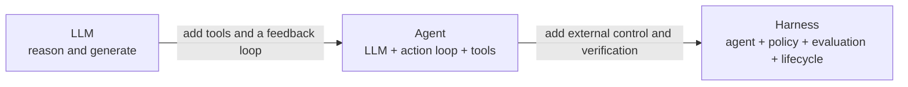
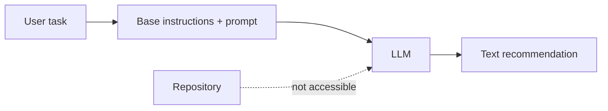
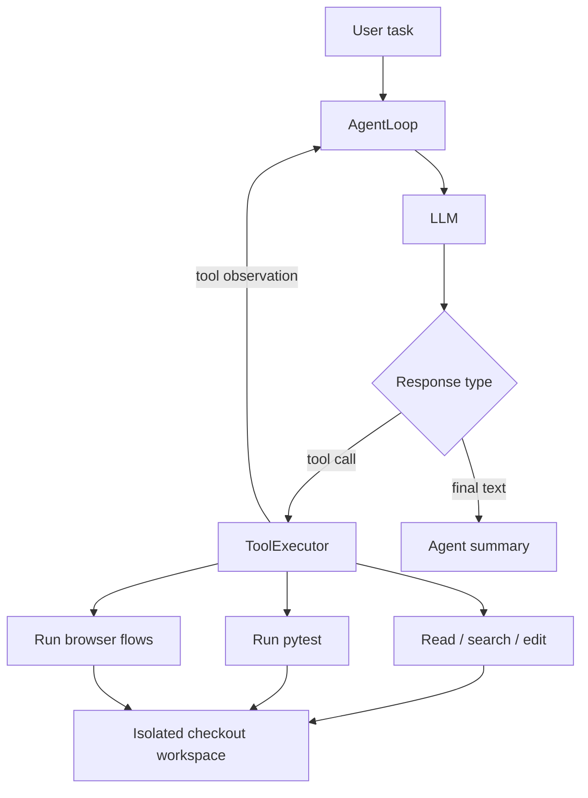
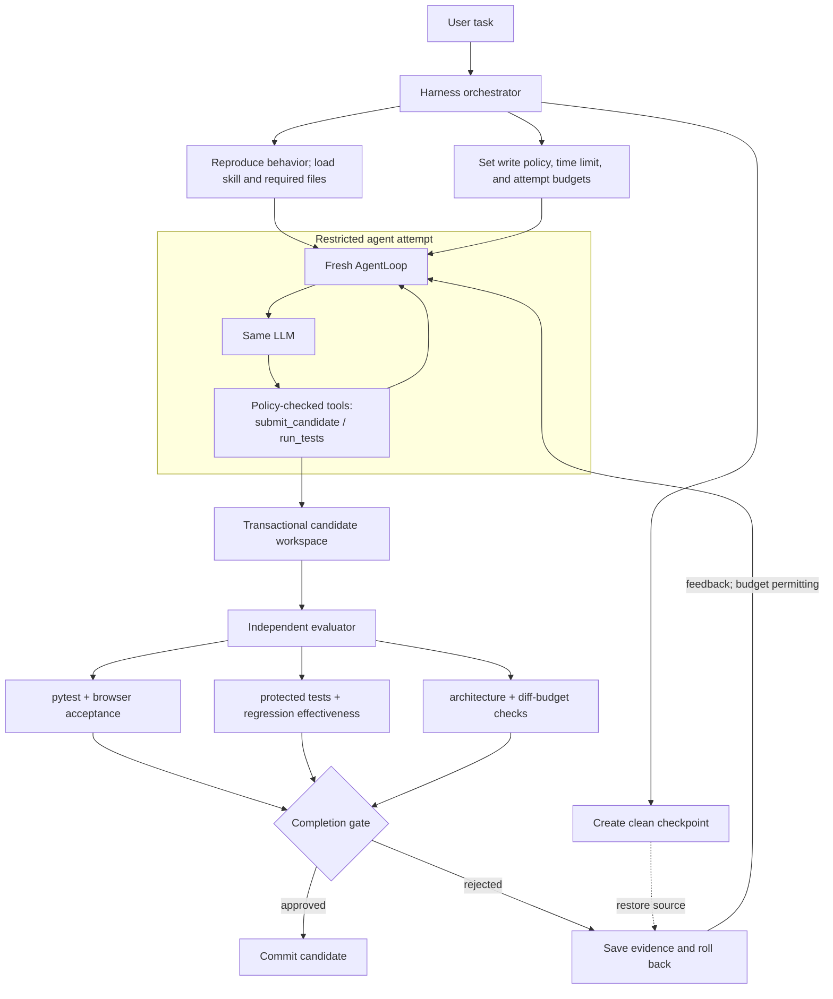

# LLM, agent, and harness architecture

This demo holds the task prompt and model constant across all three stages. The
difference is the system around the model: an LLM can propose an answer, an agent
can take actions, and a harness can constrain and independently judge those
actions.

## At a glance

| Stage | What it does | Repository access | Who decides it is done? |
| --- | --- | --- | --- |
| **LLM** | Produces a text recommendation from the prompt. | None | The model returns text. |
| **Agent** | Repeatedly asks the LLM what to do, executes its tool calls, and returns observations so it can inspect, edit, and test the checkout. | Read/write tools, pytest, and browser checks | The agent stops when the LLM returns a final answer or its budget is exhausted. |
| **Harness** | Runs a restricted agent inside an outer control system that supplies context, enforces policy, evaluates candidates, and commits or rolls back changes. | A narrow, policy-controlled tool set | An independent completion gate approves the candidate. |

The important structural relationship is containment:

## 1. LLM: recommendation only

The `llm` stage sends the shared task directly to the model with no tools. The
model can explain a likely fix, but it cannot inspect the actual files, change the
checkout, run tests, or establish that its recommendation works.

This is a single inference boundary: prompt in, generated text out.

## 2. Agent: model-directed action loop

The `agent` stage places the same LLM inside `AgentLoop`. The model may request
tools; `ToolExecutor` performs each request against the isolated checkout and
returns the result as a new observation. This lets the model gather evidence,
edit files, run pytest, and exercise browser flows before choosing to stop.

The agent is more capable than the bare LLM, but it is also its own completion
authority: tool results can inform its judgment, yet no separate component must
agree that the work is correct.

## 3. Harness: governed execution and independent completion

The `harness` stage wraps a deliberately narrower agent with controls that the
agent does not own. Before an attempt, the harness reproduces the reported
behavior, loads the debugging skill, preloads required files, applies a strict
write policy, and checkpoints the workspace. The agent then submits an atomic
application-and-regression-test candidate.

After every attempt, the harness evaluates the workspace independently. It runs
pytest and browser acceptance flows, protects existing tests, confirms that the
new regression test fails on the buggy starter, checks the state architecture,
and enforces the changed-file budget. Only the completion gate can commit the
candidate; a rejected candidate is saved as evidence, rolled back, and—within
the revision and time budgets—fed back into a fresh attempt.

## Why the distinction matters

The LLM is the reasoning and generation component. The agent is an execution
architecture built around that LLM. The harness is the control architecture
built around the agent. As the system grows outward, authority moves away from
the model: tools determine what actions actually occurred, policies determine
what actions are allowed, and the completion gate determines whether the result
is accepted.

In this repository, all stages also write run evidence under `.runs/`, but that
logging does not itself make an agent a harness. The defining difference is that
the harness owns constraints, rollback, and an independent pass/fail decision.
